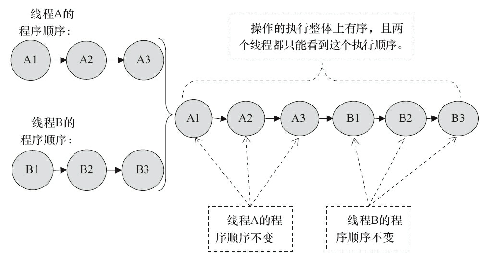

# 顺序一致性内存模型

顺序一致性内存模型是一个被计算机科学家理想化了的理论参考模型，它为程序员提供了极强的内存可见性保证。顺序一致性内存模型有两大特性。

1）一个线程中的所有操作必须按照程序的顺序来执行。

2）（不管程序是否同步）所有线程都只能看到一个单一的操作执行顺序。在顺序一致性内

存模型中，每个操作都必须原子执行且立刻对所有线程可见。顺序一致性内存模型为程序员提供的视图如图1所示。

图1

在概念上，顺序一致性模型有一个单一的全局内存，这个内存通过一个左右摆动的开关可以连接到任意一个线程，同时每一个线程必须按照程序的顺序来执行内存读/写操作。从上面的示意图可以看出，在任意时间点最多只能有一个线程可以连接到内存。当多个线程并发执行时，图中的开关装置能把所有线程的所有内存读/写操作串行化（即在顺序一致性模型中，所有操作之间具有全序关系）。为了更好进行理解，下面通过两个示意图来对顺序一致性模型的特性做进一步的说明。

假设有两个线程A和B并发执行。其中A线程有3个操作，它们在程序中的顺序是：A1→A2→A3。B线程也有3个操作，它们在程序中的顺序是：B1→B2→B3。

假设这两个线程使用监视器锁来正确同步：A线程的3个操作执行后释放监视器锁，随后B线程获取同一个监视器锁。那么程序在顺序一致性模型中的执行效果将如图2所示。

图2

未同步程序在顺序一致性模型中虽然整体执行顺序是无序的，但所有线程都只能看到一个一致的整体执行顺序。以上图为例，线程A和B看到的执行顺序都是：B1→A1→A2→B2→A3→B3。之所以能得到这个保证是因为顺序一致性内存模型中的每个操作必须立即对任意线程可见。

但是，在JMM中就没有这个保证。未同步程序在JMM中不但整体的执行顺序是无序的，而且所有线程看到的操作执行顺序也可能不一致。比如，在当前线程把写过的数据缓存在本地内存中，在没有刷新到主内存之前，这个写操作仅对当前线程可见；从其他线程的角度来观察，会认为这个写操作根本没有被当前线程执行。只有当前线程把本地内存中写过的数据刷新到主内存之后，这个写操作才能对其他线程可见。在这种情况下，当前线程和其他线程看到的操作执行顺序将不一致。

