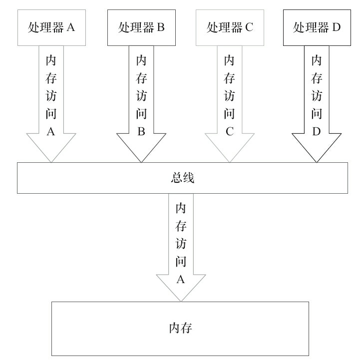

# 未同步程序的执行特性

对于未同步或未正确同步的多线程程序，JMM只提供最小安全性：线程执行时读取到的值，要么是之前某个线程写入的值，要么是默认值（0，Null，False），JMM保证线程读操作读取到的值不会无中生有（Out Of Thin Air）的冒出来。为了实现最小安全性，JVM在堆上分配对象时，首先会对内存空间进行清零，然后才会在上面分配对象（JVM内部会同步这两个操作）。因此，在已清零的内存空间（Pre-zeroed Memory）分配对象时，域的默认初始化已经完成了。JMM不保证未同步程序的执行结果与该程序在顺序一致性模型中的执行结果一致。因为如果想要保证执行结果一致，JMM需要禁止大量的处理器和编译器的优化，这对程序的执行性能会产生很大的影响。而且未同步程序在顺序一致性模型中执行时，整体是无序的，其执行结果往往无法预知。而且，保证未同步程序在这两个模型中的执行结果一致没什么意义。未同步程序在JMM中的执行时，整体上是无序的，其执行结果无法预知。未同步程序在两个模型中的执行特性有如下几个差异。

1）顺序一致性模型保证单线程内的操作会按程序的顺序执行，而JMM不保证单线程内的操作会按程序的顺序执行（比如上面正确同步的多线程程序在临界区内的重排序）。这一点前面已经讲过了，这里就不再赘述。

2）顺序一致性模型保证所有线程只能看到一致的操作执行顺序，而JMM不保证所有线程能看到一致的操作执行顺序。这一点前面也已经讲过，这里就不再赘述。

3）JMM不保证对64位的long型和double型变量的写操作具有原子性，而顺序一致性模型保证对所有的内存读/写操作都具有原子性。

第3个差异与处理器总线的工作机制密切相关。在计算机中，数据通过总线在处理器和内存之间传递。每次处理器和内存之间的数据传递都是通过一系列步骤来完成的，这一系列步骤称之为总线事务（Bus Transaction）。总线事务包括读事务（Read Transaction）和写事务（WriteTransaction）。读事务从内存传送数据到处理器，写事务从处理器传送数据到内存，每个事务会读/写内存中一个或多个物理上连续的字。这里的关键是，总线会同步试图并发使用总线的事务。在一个处理器执行总线事务期间，总线会禁止其他的处理器和I/O设备执行内存的读/写。下面，让我们通过一个示意图来说明总线的工作机制，如图1所示。

图1

由图可知，假设处理器A，B和C同时向总线发起总线事务，这时总线仲裁（Bus Arbitration）会对竞争做出裁决，这里假设总线在仲裁后判定处理器A在竞争中获胜（总线仲裁会确保所有处理器都能公平的访问内存）。此时处理器A继续它的总线事务，而其他两个处理器则要等待处理器A的总线事务完成后才能再次执行内存访问。假设在处理器A执行总线事务期间（不管这个总线事务是读事务还是写事务），处理器D向总线发起了总线事务，此时处理器D的请求会被总线禁止。

总线的这些工作机制可以把所有处理器对内存的访问以串行化的方式来执行。在任意时间点，最多只能有一个处理器可以访问内存。这个特性确保了单个总线事务之中的内存读/写操作具有原子性。

在一些32位的处理器上，如果要求对64位数据的写操作具有原子性，会有比较大的开销。为了照顾这种处理器，Java语言规范鼓励但不强求JVM对64位的long型变量和double型变量的写操作具有原子性。当JVM在这种处理器上运行时，可能会把一个64位long/double型变量的写操作拆分为两个32位的写操作来执行。这两个32位的写操作可能会被分配到不同的总线事务中执行，此时对这个64位变量的写操作将不具有原子性。当单个内存操作不具有原子性时，可能会产生意想不到后果。请看示意图，如图2所示。

图2

如上图所示，假设处理器A写一个long型变量，同时处理器B要读这个long型变量。处理器A中64位的写操作被拆分为两个32位的写操作，且这两个32位的写操作被分配到不同的写事务中执行。同时，处理器B中64位的读操作被分配到单个的读事务中执行。当处理器A和B按上图的时序来执行时，处理器B将看到仅仅被处理器A“写了一半”的无效值。

注意，在JSR-133之前的旧内存模型中，一个64位long/double型变量的读/写操作可以被拆分为两个32位的读/写操作来执行。从JSR-133内存模型开始（即从JDK5开始），仅仅只允许把一个64位long/double型变量的写操作拆分为两个32位的写操作来执行，任意的读操作在JSR-133中都必须具有原子性（即任意读操作必须要在单个读事务中执行）。

