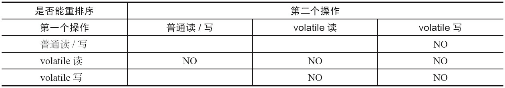
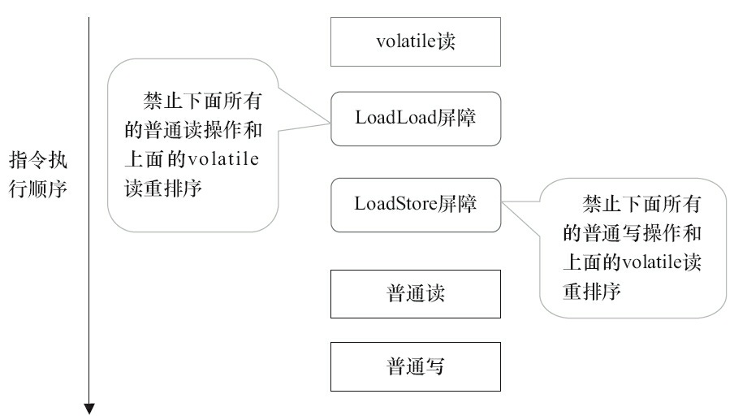
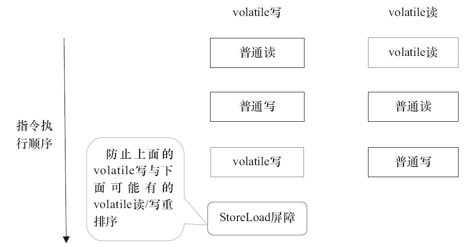

# volatile内存语义的实现

下面来看看JMM如何实现volatile写/读的内存语义。

前文提到过重排序分为编译器重排序和处理器重排序。为了实现volatile内存语义，JMM会分别限制这两种类型的重排序类型。表1是JMM针对编译器制定的volatile重排序规则表。

表1

举例来说，第三行最后一个单元格的意思是：在程序中，当第一个操作为普通变量的读或写时，如果第二个操作为volatile写，则编译器不能重排序这两个操作。

从表1我们可以看出。

·当第二个操作是volatile写时，不管第一个操作是什么，都不能重排序。这个规则确保volatile写之前的操作不会被编译器重排序到volatile写之后。

·当第一个操作是volatile读时，不管第二个操作是什么，都不能重排序。这个规则确保volatile读之后的操作不会被编译器重排序到volatile读之前。

·当第一个操作是volatile写，第二个操作是volatile读时，不能重排序。为了实现volatile的内存语义，编译器在生成字节码时，会在指令序列中插入内存屏障来

禁止特定类型的处理器重排序。对于编译器来说，发现一个最优布置来最小化插入屏障的总数几乎不可能。为此，JMM采取保守策略。下面是基于保守策略的JMM内存屏障插入策略。

·在每个volatile写操作的前面插入一个StoreStore屏障。

·在每个volatile写操作的后面插入一个StoreLoad屏障。

·在每个volatile读操作的后面插入一个LoadLoad屏障。

·在每个volatile读操作的后面插入一个LoadStore屏障。

上述内存屏障插入策略非常保守，但它可以保证在任意处理器平台，任意的程序中都能得到正确的volatile内存语义。

下面是保守策略下，volatile写插入内存屏障后生成的指令序列示意图，如图2所示。

图2

图2中的StoreStore屏障可以保证在volatile写之前，其前面的所有普通写操作已经对任意处理器可见了。这是因为StoreStore屏障将保障上面所有的普通写在volatile写之前刷新到主内存。

这里比较有意思的是，volatile写后面的StoreLoad屏障。此屏障的作用是避免volatile写与后面可能有的volatile读/写操作重排序。因为编译器常常无法准确判断在一个volatile写的后面是否需要插入一个StoreLoad屏障（比如，一个volatile写之后方法立即return）。为了保证能正确实现volatile的内存语义，JMM在采取了保守策略：在每个volatile写的后面，或者在每个volatile读的前面插入一个StoreLoad屏障。从整体执行效率的角度考虑，JMM最终选择了在每个volatile写的后面插入一个StoreLoad屏障。因为volatile写-读内存语义的常见使用模式是：一个写线程写volatile变量，多个读线程读同一个volatile变量。当读线程的数量大大超过写线程时，选择在volatile写之后插入StoreLoad屏障将带来可观的执行效率的提升。

从这里可以看到**JMM在实现上的一个特点：首先确保正确性，然后再去追求执行效率**。

下面是在保守策略下，volatile读插入内存屏障后生成的指令序列示意图，如图3所示。

图3

图3中的LoadLoad屏障用来禁止处理器把上面的volatile读与下面的普通读重排序。LoadStore屏障用来禁止处理器把上面的volatile读与下面的普通写重排序。

上述volatile写和volatile读的内存屏障插入策略非常保守。在实际执行时，只要不改变volatile写-读的内存语义，编译器可以根据具体情况省略不必要的屏障。

下面通过具体的示例代码进行说明：

```text
class VolatileBarrierExample {
    int a;
    volatile int v1 = 1;
    volatile int v2 = 2;
    void readAndWrite() {
        int i = v1;　　// 第一个volatile读
        int j = v2; 　// 第二个volatile读
        a = i + j; // 普通写
        v1 = i + 1; 　// 第一个volatile写
        v2 = j * 2; 　// 第二个 volatile写
    }
…　　　　　　// 其他方法
}
```

针对readAndWrite\(\)方法，编译器在生成字节码时可以做如下的优化。

图4

注意，最后的StoreLoad屏障不能省略。因为第二个volatile写之后，方法立即return。此时编译器可能无法准确断定后面是否会有volatile读或写，为了安全起见，编译器通常会在这里插入一个StoreLoad屏障。

上面的优化针对任意处理器平台，由于不同的处理器有不同“松紧度”的处理器内存模型，内存屏障的插入还可以根据具体的处理器内存模型继续优化。以X86处理器为例，图4中除最后的StoreLoad屏障外，其他的屏障都会被省略。前面保守策略下的volatile读和写，在X86处理器平台可以优化成如图5所示。前文提到过，X86处理器仅会对写-读操作做重排序。X86不会对读-读、读-写和写-写操作

做重排序，因此在X86处理器中会省略掉这3种操作类型对应的内存屏障。在X86中，JMM仅需在volatile写后面插入一个StoreLoad屏障即可正确实现volatile写-读的内存语义。这意味着在X86处理器中，volatile写的开销比volatile读的开销会大很多（因为执行StoreLoad屏障开销会比较大）。

图5

