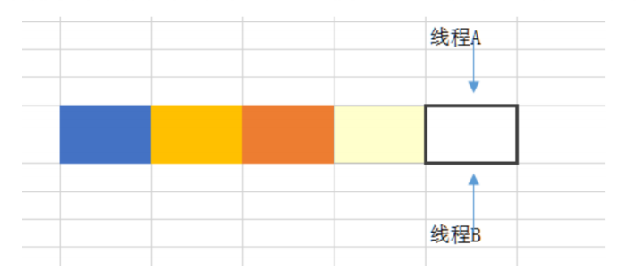

# HashMap原理（面试篇二）

**HashMap 是线程安全的吗，为什么不是线程安全的（最好画图说明多线程 环境下不安全）?** 

不是线程安全的； 如果有两个线程A和B，都进行插入数据，刚好这两条不同的数据经过哈希计算后得到的哈希码是一样的，且该位 置还没有其他的数据。所以这两个线程都会进入我在上面标记为1的代码中。假设一种情况，线程A通过if判断，该 位置没有哈希冲突，进入了if语句，还没有进行数据插入，这时候 CPU 就把资源让给了线程B，线程A停在了if语句 里面，线程B判断该位置没有哈希冲突（线程A的数据还没插入），也进入了if语句，线程B执行完后，轮到线程A执 行，现在线程A直接在该位置插入而不用再判断。这时候，你会发现线程A把线程B插入的数据给覆盖了。发生了线 程不安全情况。本来在 HashMap 中，发生哈希冲突是可以用链表法或者红黑树来解决的，但是在多线程中，可能 就直接给覆盖了。 上面所说的是一个图来解释可能更加直观。如下面所示，两个线程在同一个位置添加数据，后面添加的数据就覆盖 住了前面添加的。

如果上述插入是插入到链表上，如两个线程都在遍历到最后一个节点，都要在最后添加一个数据，那么后面添加数 据的线程就会把前面添加的数据给覆盖住。则

在扩容的时候也可能会导致数据不一致，因为扩容是从一个数组拷贝到另外一个数组。

