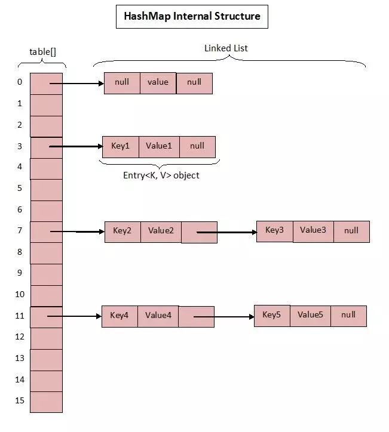
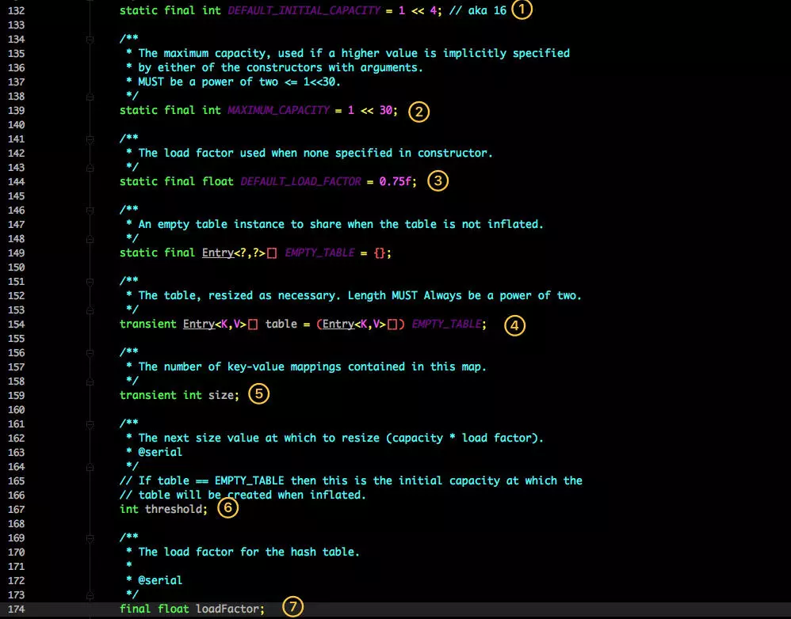
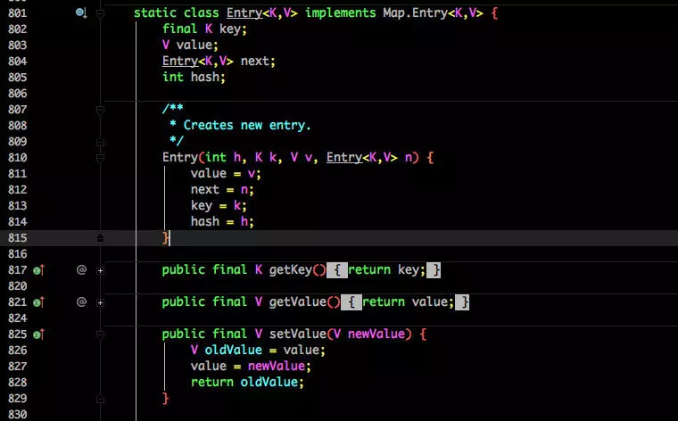
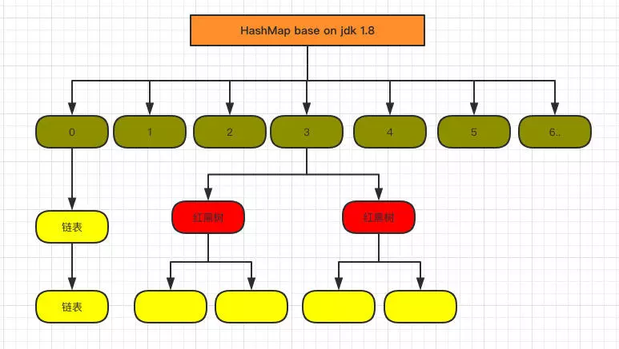
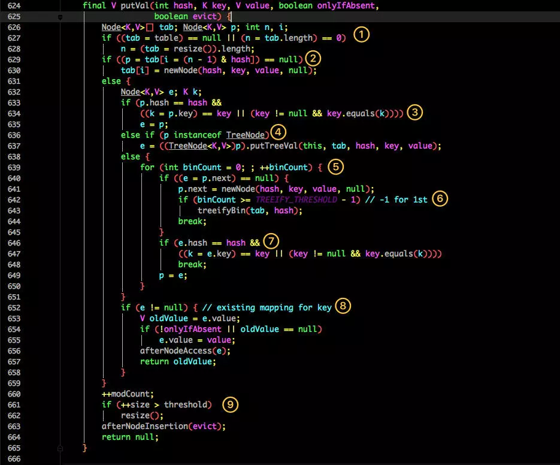
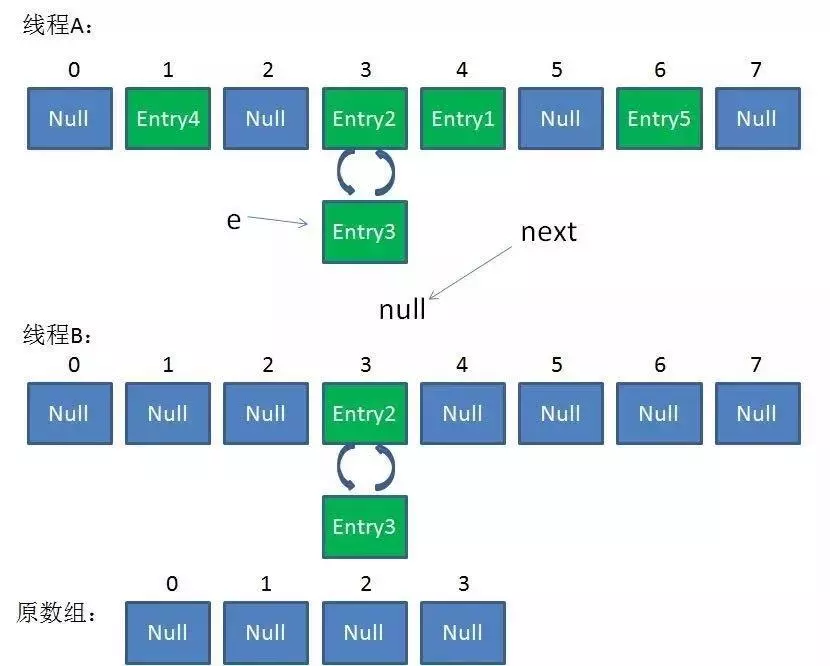

# 讲解\(二\)

## **前言**

Map 这样的 Key Value 在软件开发中是非常经典的结构，常用于在内存中存放数据。

## **HashMap**

* **Base 1.7**

**1.7 中的数据结构图：**



**先来看看 1.7 中的实现。**



**这是 HashMap 中比较核心的几个成员变量；看看分别是什么意思？**

1. 初始化桶大小，因为底层是数组，所以这是数组默认的大小。
2. 桶最大值。
3. 默认的负载因子（0.75）
4. table 真正存放数据的数组。
5. Map 存放数量的大小。
6. 桶大小，可在初始化时显式指定。
7. 负载因子，可在初始化时显式指定。

**重点解释下负载因子：**

由于给定的 HashMap 的容量大小是固定的，比如默认初始化：

```text
 public HashMap() {
        this(DEFAULT_INITIAL_CAPACITY, DEFAULT_LOAD_FACTOR);
    }

    public HashMap(int initialCapacity, float loadFactor) {
        if (initialCapacity < 0)
            throw new IllegalArgumentException("Illegal initial capacity: " +
                                               initialCapacity);
        if (initialCapacity > MAXIMUM_CAPACITY)
            initialCapacity = MAXIMUM_CAPACITY;
        if (loadFactor <= 0 || Float.isNaN(loadFactor))
            throw new IllegalArgumentException("Illegal load factor: " +
                                               loadFactor);

        this.loadFactor = loadFactor;
        threshold = initialCapacity;
        init();
    }
```

给定的默认容量为 16，负载因子为 0.75。Map 在使用过程中不断的往里面存放数据，当数量达到了 16 \* 0.75 = 12 就需要将当前 16 的容量进行扩容，而扩容这个过程涉及到 rehash、复制数据等操作，所以非常消耗性能。

因此通常建议能提前预估 HashMap 的大小最好，尽量的减少扩容带来的性能损耗。

**根据代码可以看到其实真正存放数据的是transient Entry&lt;K,V&gt;\[\] table = \(Entry&lt;K,V&gt;\[\]\) EMPTY\_TABLE;**

**这个数组，那么它又是如何定义的呢？**



Entry 是 HashMap 中的一个内部类，从他的成员变量很容易看出：

* key 就是写入时的键。
* value 自然就是值。
* 开始的时候就提到 HashMap 是由数组和链表组成，所以这个 next 就是用于实现链表结构。
* hash 存放的是当前 key 的 hashcode。

知晓了基本结构，那来看看其中重要的写入、获取函数：

#### **put 方法**

```text
 public V put(K key, V value) {
        if (table == EMPTY_TABLE) {
            inflateTable(threshold);
        }
        if (key == null)
            return putForNullKey(value);
        int hash = hash(key);
        int i = indexFor(hash, table.length);
        for (Entry<K,V> e = table[i]; e != null; e = e.next) {
            Object k;
            if (e.hash == hash && ((k = e.key) == key || key.equals(k))) {
                V oldValue = e.value;
                e.value = value;
                e.recordAccess(this);
                return oldValue;
            }
        }

        modCount++;
        addEntry(hash, key, value, i);
        return null;
    }
```

* 判断当前数组是否需要初始化。
* 如果 key 为空，则 put 一个空值进去。
* 根据 key 计算出 hashcode。
* 根据计算出的 hashcode 定位出所在桶。
* 如果桶是一个链表则需要遍历判断里面的 hashcode、key 是否和传入 key 相等，如果相等则进行覆盖，并返回原来的值。
* 如果桶是空的，说明当前位置没有数据存入；新增一个 Entry 对象写入当前位置。

**addEntry\(hash, key, value, i\);实现**

```text
void addEntry(int hash, K key, V value, int bucketIndex) {
        if ((size >= threshold) && (null != table[bucketIndex])) {
            resize(2 * table.length);
            hash = (null != key) ? hash(key) : 0;
            bucketIndex = indexFor(hash, table.length);
        }

        createEntry(hash, key, value, bucketIndex);
    }

    void createEntry(int hash, K key, V value, int bucketIndex) {
        Entry<K,V> e = table[bucketIndex];
        table[bucketIndex] = new Entry<>(hash, key, value, e);
        size++;
    }
```

当调用 addEntry 写入 Entry 时需要判断是否需要扩容。

如果需要就进行两倍扩充，并将当前的 key 重新 hash 并定位。而在 createEntry 中会将当前位置的桶传入到新建的桶中，如果当前桶有值就会在位置形成链表。

#### **get 方法**

```text
public V get(Object key) {
        if (key == null)
            return getForNullKey();
        Entry<K,V> entry = getEntry(key);

        return null == entry ? null : entry.getValue();
    }

    final Entry<K,V> getEntry(Object key) {
        if (size == 0) {
            return null;
        }

        int hash = (key == null) ? 0 : hash(key);
        for (Entry<K,V> e = table[indexFor(hash, table.length)];
             e != null;
             e = e.next) {
            Object k;
            if (e.hash == hash &&
                ((k = e.key) == key || (key != null && key.equals(k))))
                return e;
        }
        return null;
    }
```

* 首先也是根据 key 计算出 hashcode，然后定位到具体的桶中。
* 判断该位置是否为链表。
* 不是链表就根据 key、key 的 hashcode 是否相等来返回值。
* 为链表则需要遍历直到 key 及 hashcode 相等时候就返回值。
* 啥都没取到就直接返回 null 。
* **Base 1.8**

不知道 1.7 的实现大家看出需要优化的点没有？

> 其实一个很明显的地方就是：
>
> 当 Hash 冲突严重时，在桶上形成的链表会变的越来越长，这样在查询时的效率就会越来越低；时间复杂度为 O\(N\)。

因此 1.8 中重点优化了这个查询效率。

1.8 HashMap 结构图：



先来看看几个核心的成员变量：

```text
static final int DEFAULT_INITIAL_CAPACITY = 1 << 4; // aka 16

    /**
     * The maximum capacity, used if a higher value is implicitly specified
     * by either of the constructors with arguments.
     * MUST be a power of two <= 1<<30.
     */
    static final int MAXIMUM_CAPACITY = 1 << 30;

    /**
     * The load factor used when none specified in constructor.
     */
    static final float DEFAULT_LOAD_FACTOR = 0.75f;

    static final int TREEIFY_THRESHOLD = 8;

    transient Node<K,V>[] table;

    /**
     * Holds cached entrySet(). Note that AbstractMap fields are used
     * for keySet() and values().
     */
    transient Set<Map.Entry<K,V>> entrySet;

    /**
     * The number of key-value mappings contained in this map.
     */
    transient int size;
```

和 1.7 大体上都差不多，还是有几个重要的区别：

* TREEIFY\_THRESHOLD 用于判断是否需要将链表转换为红黑树的阈值。
* HashEntry 修改为 Node。

Node 的核心组成其实也是和 1.7 中的 HashEntry 一样，存放的都是 key value hashcode next 等数据。

**再来看看核心方法。**

#### **put 方法**



看似要比 1.7 的复杂，我们一步步拆解：

1. 判断当前桶是否为空，空的就需要初始化（resize 中会判断是否进行初始化）。
2. 根据当前 key 的 hashcode 定位到具体的桶中并判断是否为空，为空表明没有 Hash 冲突就直接在当前位置创建一个新桶即可。
3. 如果当前桶有值（ Hash 冲突），那么就要比较当前桶中的 key、key 的 hashcode 与写入的 key 是否相等，相等就赋值给 e,在第 8 步的时候会统一进行赋值及返回。
4. 如果当前桶为红黑树，那就要按照红黑树的方式写入数据。
5. 如果是个链表，就需要将当前的 key、value 封装成一个新节点写入到当前桶的后面（形成链表）。
6. 接着判断当前链表的大小是否大于预设的阈值，大于时就要转换为红黑树。
7. 如果在遍历过程中找到 key 相同时直接退出遍历。
8. 如果 e != null 就相当于存在相同的 key,那就需要将值覆盖。
9. 最后判断是否需要进行扩容。

#### **get 方法**

```text
public V get(Object key) {
        Node<K,V> e;
        return (e = getNode(hash(key), key)) == null ? null : e.value;
    }

    final Node<K,V> getNode(int hash, Object key) {
        Node<K,V>[] tab; Node<K,V> first, e; int n; K k;
        if ((tab = table) != null && (n = tab.length) > 0 &&
            (first = tab[(n - 1) & hash]) != null) {
            if (first.hash == hash && // always check first node
                ((k = first.key) == key || (key != null && key.equals(k))))
                return first;
            if ((e = first.next) != null) {
                if (first instanceof TreeNode)
                    return ((TreeNode<K,V>)first).getTreeNode(hash, key);
                do {
                    if (e.hash == hash &&
                        ((k = e.key) == key || (key != null && key.equals(k))))
                        return e;
                } while ((e = e.next) != null);
            }
        }
        return null;
    }
```

get 方法看起来就要简单许多了。

* 首先将 key hash 之后取得所定位的桶。
* 如果桶为空则直接返回 null 。
* 否则判断桶的第一个位置\(有可能是链表、红黑树\)的 key 是否为查询的 key，是就直接返回 value。
* 如果第一个不匹配，则判断它的下一个是红黑树还是链表。
* 红黑树就按照树的查找方式返回值。
* 不然就按照链表的方式遍历匹配返回值。

**从这两个核心方法（get/put）可以看出 1.8 中对大链表做了优化，修改为红黑树之后查询效率直接提高到了 O\(logn\)。**

**但是 HashMap 原有的问题也都存在，比如在并发场景下使用时容易出现死循环。**

```text
final HashMap<String, String> map = new HashMap<String, String>();
for (int i = 0; i < 1000; i++) {
    new Thread(new Runnable() {
        @Override
        public void run() {
            map.put(UUID.randomUUID().toString(), "");
        }
    }).start();
}
```

但是为什么呢？简单分析下。

看过上文的还记得在 HashMap 扩容的时候会调用 resize\(\) 方法，就是这里的并发操作容易在一个桶上形成环形链表；这样当获取一个不存在的 key 时，计算出的 index 正好是环形链表的下标就会出现死循环。

如下图：



参考文档：

[HashMap多线程环境下导致死循环问题详解](https://blog.csdn.net/zhangjunli/article/details/80653283)

### **遍历方式**

还有一个值得注意的是 HashMap 的遍历方式，通常有以下几种：

```text
Iterator<Map.Entry<String, Integer>> entryIterator = map.entrySet().iterator();
        while (entryIterator.hasNext()) {
            Map.Entry<String, Integer> next = entryIterator.next();
            System.out.println("key=" + next.getKey() + " value=" + next.getValue());
        }

Iterator<String> iterator = map.keySet().iterator();
        while (iterator.hasNext()){
            String key = iterator.next();
            System.out.println("key=" + key + " value=" + map.get(key));

        }
```

强烈建议使用第一种 EntrySet 进行遍历。

第一种可以把 key value 同时取出，第二种还得需要通过 key 取一次 value，效率较低。

> 简单总结下 HashMap：无论是 1.7 还是 1.8 其实都能看出 JDK 没有对它做任何的同步操作，所以并发会出问题，甚至出现死循环导致系统不可用。

